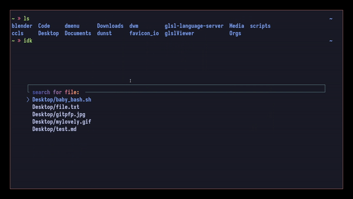

🟥 🟨 🟩
# idk (**WIP**)
***a Terminal-Based File Manager***

<!-- INDEX -->
### Index

[About](#About) 
[Showcase](#Showcase)  

<!-- ABOUT -->

## About 📚

    idk is a simple, terminal based file manager/explorer, that was inspired by the frustrations faced from using other CLI based tools that try to do much more than what they need to.
     
     
    Most of the time, you only need to be searching in the current working directory. Though other file explorers can do this, they opt for systems that require traversal through each directory to get to, or search through, a sub-directory.
     
     
    idk takes a different approach, and probes downwards, so any search query will be passed through a fuzzy finder that is being fed all the files of the current directory, and any sub-directories.

<!-- ABOUT SCRIPTS -->
<!-- SHOWCASE -->

## Showcase 🎥

<!-- SHOWCASE _BOOKMARKTHIS -->

### basic usage

 
the most efficient and basic use case
 
 

<!-- SHOWCASE _SNIPPETS -->

### handling of zipped files

Unzipping files can be somewhat hazardous at times, particularly if you don't check the contents of the zip beforehand, and accidentally inflate a bunch of files into a previously well organized directory. As I often do ;), hence, the built in solution for idk.

 
 
The solution I've implemented is a fairly simple, yet powerful.

1. extract a relevant name from the selected file via a regular expression
1. create a directory with said name, and unzip the file into the directory.

Super simple, right? The true power of this comes from the fact that you can run idk from your home directory, as I have done in the example gif below, and grab your zip file from whatever nested location it lives in. This is particularly powerful if you have a helper script that organizes files based on extension. As you could extract the contents of each zip wherever you need it, and leave the original zip file untouched.

 

<!-- SHOWCASE _YMATRIX -->

